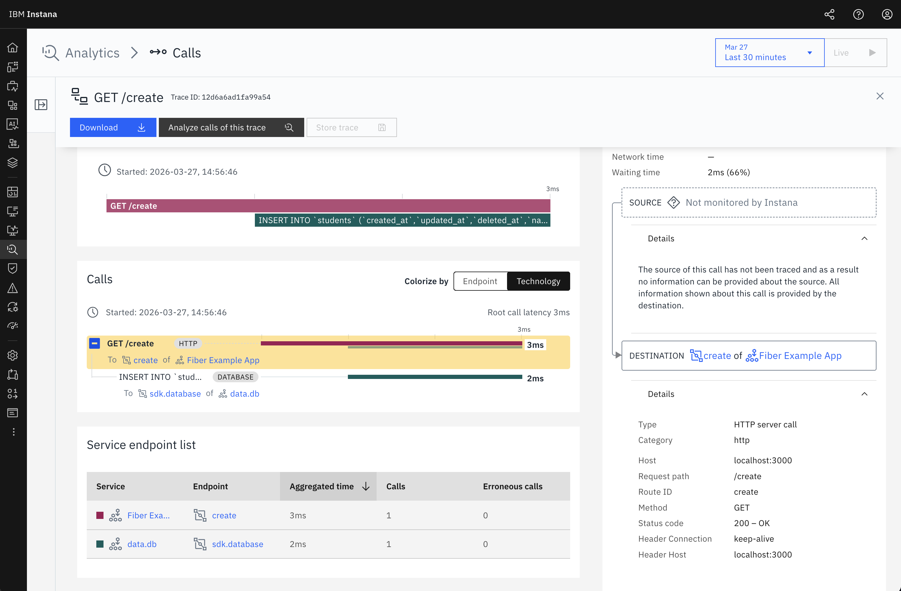

# Fiber v3 Instrumentation Example

This is a simple example demonstrating how to use Instana's Fiber v3 instrumentation with Go. The example showcases context propagation for HTTP requests and database operations.

## Prerequisites

Before running this example, ensure you have:

1. **Go 1.25.0 or later** installed
2. **Instana Agent** running and accessible to the application

## Installation

1. Clone the repository and navigate to this example:
```bash
cd example/basic_usage_fiber
```

2. Install dependencies:
```bash
go mod download
```

## Running the Application

1. **Start the Instana Agent** (if not already running):
   - Follow the [Instana Agent installation guide](https://www.ibm.com/docs/en/instana-observability/current?topic=agents-installing-host)
   - Ensure the agent is running and ready to accept connections

2. **Run the application**:
```bash
go run main.go
```

1. Wait for the application to start. You should see:
```
Instana agent ready
Starting server on :3000
```

## Testing the Application

Once the application is running, test it by calling the `/create` endpoint:

```bash
curl http://localhost:3000/create
```

**Expected Response:**
```
Student added to DB!
```

**Console Output:**
```
Student added to DB!
```

## Viewing Results in Instana

After making requests to the application:

1. Open your **Instana UI**
2. Navigate to **Applications** or **Services**
3. Look for the service named **"Fiber Example App"**
4. You should see:
   - HTTP request traces for the `/create` endpoint
   - Database operation traces (SQLite INSERT operations)
   - Complete trace context propagation from HTTP → Database

### Sample Trace View


