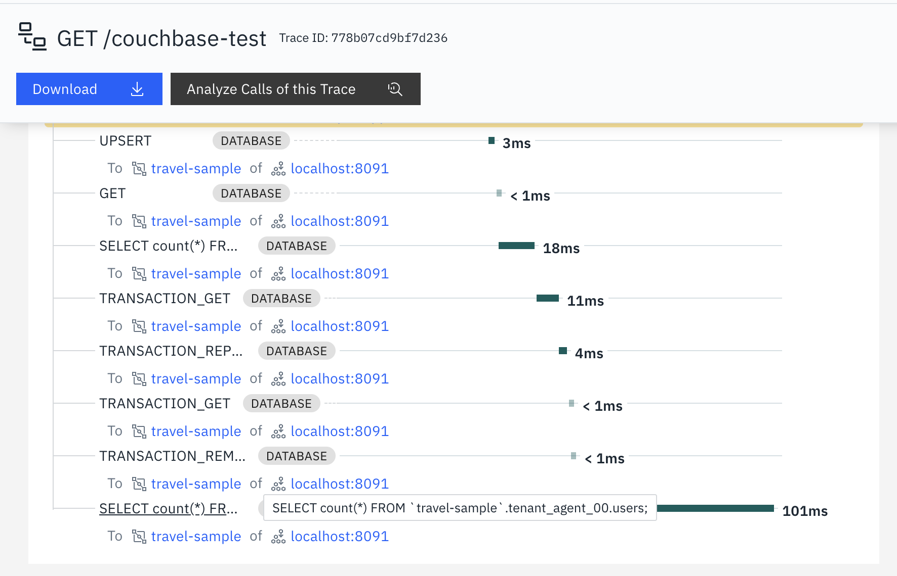

# Example Usage of instagocb

> [!NOTE]
> This example application is based on the [startusing.go example](https://github.com/couchbase/docs-sdk-go/blob/release/2.6/modules/hello-world/examples/startusing.go) from the official couchbase doc repo. 

### Run the application
```sh
cd /path/to/go-sensor/examples/couchbase
# setup couchbase/server
podman-compose -f docker-compose.yaml up #Or you can use docker compose
go mod tidy
go run .
```

### Test the application
```sh
# Test success
curl http://localhost:9990/couchbase-test

# Test error
curl http://localhost:9990/couchbase-test?error=true
```

### Output
